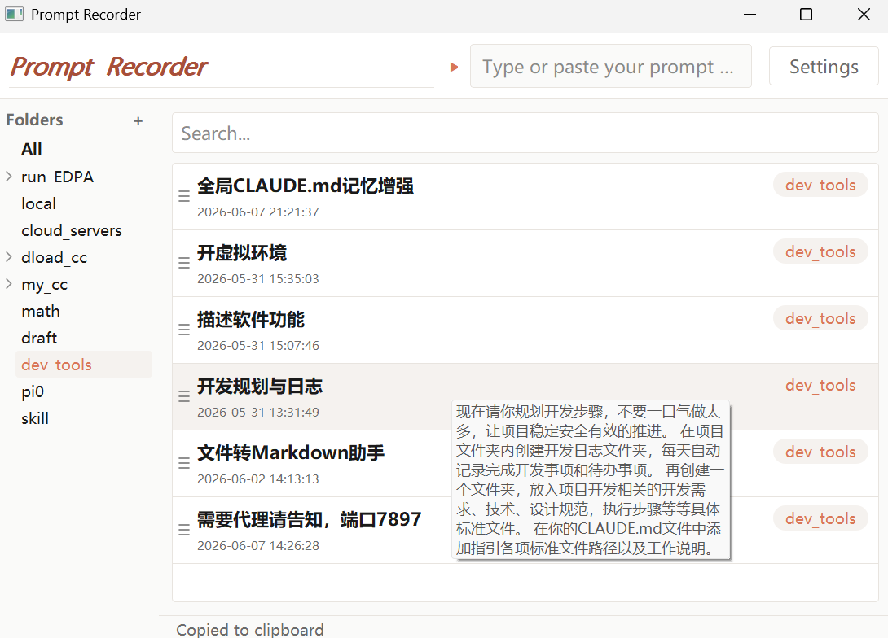

# Prompt Recorder

> 本地优先的 Prompt 管理利器 —— 分类整理、拖拽排序、AI 智能优化，让每一次提示词都值得复用。

本工具全流程基于 Claude Code（AI Agent）辅助开发。

---



---

## ✨ 功能

- **🖱️ 一键复制** —— 左键点击任意 Prompt，内容自动复制到剪贴板，投喂 AI 只需一秒
- **📂 分类管理** —— 树形文件夹 + 嵌套子文件夹，按场景归类（开发 / 写作 / 翻译…）
- **🔍 快速检索** —— 关键词搜索 + 悬停预览，200+ 条 Prompt 秒定位
- **🪟 悬浮窗** —— 始终置顶的迷你窗口，支持中英互译和命令解释，不打断工作流
- **📝 快速录入** —— 顶部输入框直接粘贴或输入，回车即保存，自动生成 AI 标题
- **🤖 AI 优化** —— 集成 DeepSeek API，一键改进 Prompt 的清晰度、结构与完整性
- **🖱️ 拖拽排序** —— Prompt 和文件夹均支持拖拽移动，自由调整顺序和归属
- **⚙️ 系统驻留** —— 启动后最小化到系统托盘，全局热键呼出，随用随走

---

## 🚀 快速开始

```bash
# 1. 安装依赖
pip install -r requirements.txt

# 2. 配置 API Key（可选，不配也能用基础功能）
# 在 src/api/ 下创建 .env 文件：
#   DEEPSEEK_API_KEY=your_key_here
#   DEEPSEEK_BASE_URL=https://api.deepseek.com

# 3. 启动
python main.py
```

启动后窗口最小化到系统托盘，左键点托盘图标呼出悬浮窗，右键打开菜单。

---

## 📖 使用说明

### 基本操作

| 操作 | 方式 |
|------|------|
| **新增 Prompt** | 顶部输入框输入或粘贴内容 → 回车，自动保存并生成 AI 标题 |
| **查看 / 复制** | 点击列表中的条目，内容自动复制到剪贴板（底部提示 `Copied to clipboard`） |
| **搜索** | 列表上方搜索框输入关键词，实时过滤 |
| **编辑 / 删除** | 悬停条目 → 点击右侧菜单图标 → 选择操作 |

### 文件夹管理

- **创建文件夹**：左侧 `Folders` 面板右键 → 新建文件夹
- **嵌套子文件夹**：支持多级层级，文件夹前有箭头表示可展开
- **移动 Prompt**：拖拽条目到目标文件夹即可
- **移动文件夹**：拖拽文件夹到另一个文件夹内，成为其子文件夹

### 悬浮窗

系统托盘图标左键点击 → 弹出悬浮窗，提供两种模式：

| 模式 | 用途 |
|------|------|
| **翻译** | 输入中文 → 英文翻译；输入英文 → 中文翻译 |
| **解释** | 输入命令/函数名/编程关键词 → 中文解释 |

悬浮窗始终置顶，不打断当前工作，按 `Esc` 关闭。

### AI 优化

在 Prompt 条目上右键 → **分析/优化**：

- **分类**：AI 自动判断该 Prompt 适合归入哪个文件夹
- **优化**：AI 改进 Prompt 的清晰度、结构、完整性，弹窗对比原版和优化版，选择「采纳」或「保留原文」
- **标题**：AI 根据内容自动生成短标题（限 20 字）

需在设置中配置 DeepSeek API Key 才能使用 AI 功能。

### 设置

顶部 `Settings` 按钮可配置：

- DeepSeek API Key 和模型选择（`deepseek-chat` / `deepseek-reasoner`）
- 字体与字号
- 开机自启
- AI 优化功能开关

---

## 🛠 技术栈

| 层面 | 技术 |
|------|------|
| GUI 框架 | PyQt5 |
| 数据库 | SQLite |
| AI 接口 | DeepSeek API（兼容 OpenAI SDK） |
| 打包 | Python 原生（`pythonw main.py` 无控制台窗口） |

---

## 📁 项目结构

```
prompt_recorder/
├── main.py                   # 入口：系统托盘、单实例锁、主窗口
├── requirements.txt
├── assets/
│   └── screenshot.png        # 应用截图
├── src/
│   ├── api/
│   │   └── deepseek_client.py   # DeepSeek API 封装
│   ├── db/
│   │   └── database.py          # SQLite CRUD
│   ├── services/
│   │   └── optimizer.py         # AI 优化 / 分类 / 标题生成
│   ├── ui/
│   │   ├── main_window.py       # 主窗口
│   │   ├── floating_window.py   # 悬浮窗
│   │   ├── folder_tree.py       # 文件夹树形侧边栏
│   │   ├── history_panel.py     # 历史 Prompt 列表
│   │   ├── analysis_dialog.py   # AI 优化结果弹窗
│   │   ├── settings_dialog.py   # 设置窗口
│   │   └── theme.py             # 全局配色与字体
│   └── config_loader.py         # 配置文件读写
└── docs/
    ├── requirements.md           # 功能需求文档
    ├── tech-spec.md              # 技术架构文档
    └── design-spec.md            # UI 设计规范
```

---

## 💡 开发背景

我日常重度使用 AI Agent 开发，发现 Prompt 管理存在三个痛点：

1. 好的 Prompt 写了就丢，下次找不到
2. Prompt 可以优化但懒得反复润色
3. 切换工具窗口打断了工作流

于是用 Claude Code 全流程 vibe coding 开发了这个工具。所有功能都围绕「不打断工作流」设计 —— 悬浮窗、系统托盘、全局热键，都是在实际使用中迭代出来的。

---

## 📌 备注

- 本仓库为个人开源作品，欢迎提 Issue 交流
- 属于 [AI Agent 开发工具体系](https://github.com/luckyfish22/AI-toolkit) 的一部分
